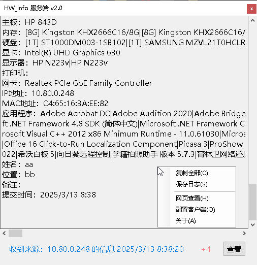
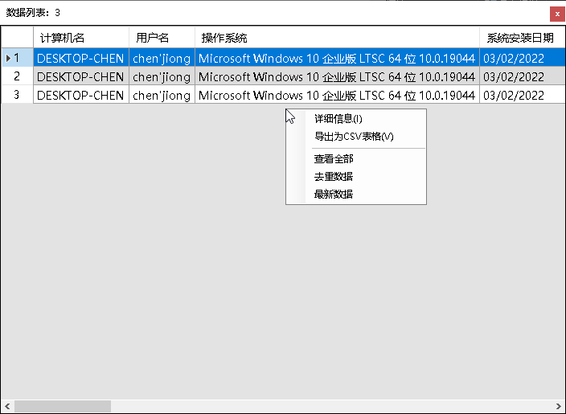
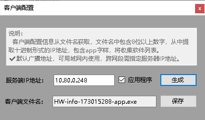
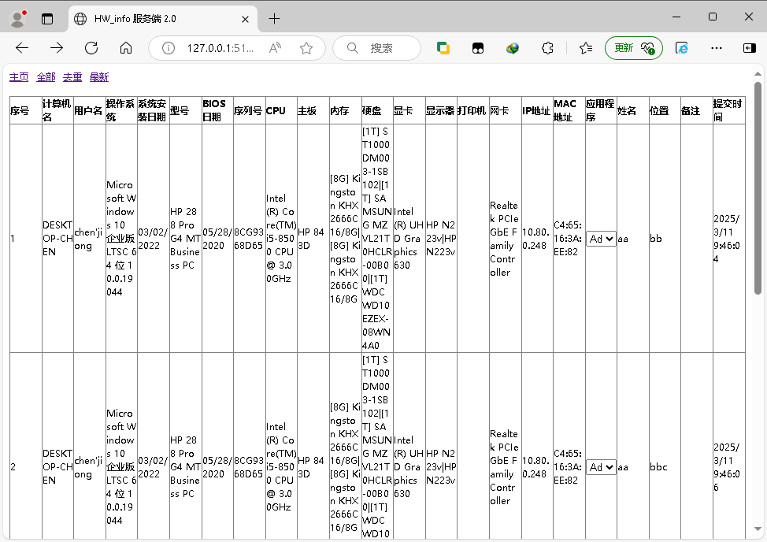
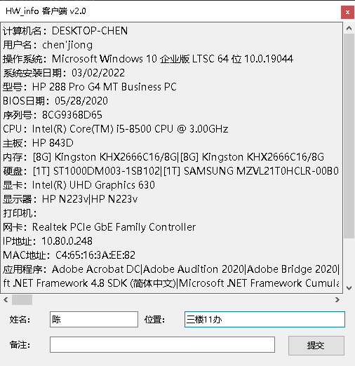
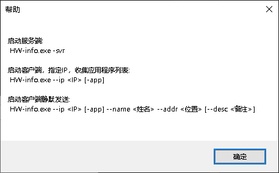

### 简介
快速批量收集电脑系统硬件信息，发送到服务端，可作资产管理。   

### 信息收集包括
计算机名，用户名，操作系统，主机型号，序列号，CPU，主板，内存，硬盘，显卡，显示器，打印机，网卡，IP地址，MAC地址。   

### 服务端
服务端客户端实际是同一个文件，启动方式文件名包含-svr或命令行参数-svr      
开放端口 udp和http 51528   

### 查看数据
可导出csv，用Excel打开   

### 配置客户端
由文件名配置ip地址和是否收集应用程序列表。   

### 网页端查看
http://ip:51528   

### 客户端
输入姓名，位置，可选备注，提交到服务端。   

### 命令行参数
命令行参数优先，使用命令行参数就不会读取文件名配置参数。[中括号内为可选]   
-? 显示帮助   
-svr 启动服务端   
--ip x.x.x.x 指定服务端IP [-app] 收集应用程序   
--ip x.x.x.x [-app] --name 姓名 --addr 位置 [--desc 备注]    

